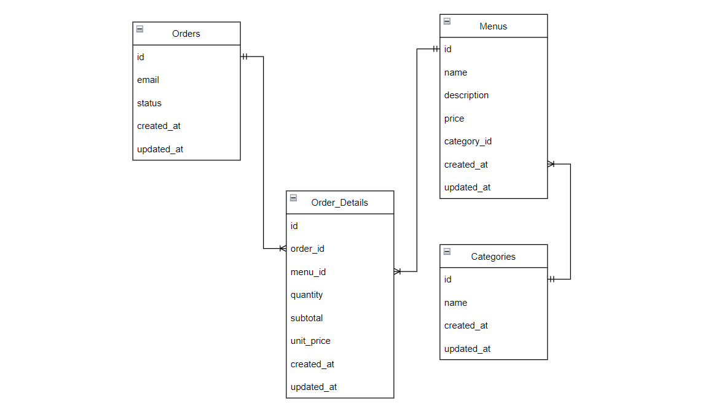

# Final Project Assignment

## Use Case 

1. Melakukan CRUD pada menu makanan dengan ketentuan nama menu tidak bisa duplikat, harga menu tidak boleh lebih kecil dari 0.01, dan deskripsi dari menu makanan tidak bisa lebih dari 150 karakter.
2. Melakukan CRUD pada kategori dengan ketentuan nama kategori tidak bisa duplikat.
3. Menambahkan order dengan format email yang valid. Order yang dilakukan customer dapat memesan lebih dari satu menu dan satu menu bisa lebih dari satu porsi.
4. Pemilik dapat melihat total harga dari tiap order. Data harga pada order sebelumnya tidak akan berubah ketika harga pada menu terjadi perubahan.
5. Status order yang berhasil dibuat secara default adalah "NEW". Pemilik dapat mengubah transaksi menjadi "PAID" pada menu tertentu dan mengubah menjadi "CANCELED" pada menu yang masih memiliki status "NEW" pada menu tertentu.
6. Pemilik dapat melihat laporan dari order yang dibuat


## Running the app

1. Tolong gunakanan "bundle exec rails s" untuk menjalankan program pada console. Terjadi masalah yang tidak saya ketahui ketika menggunakan tombol run pada replit (berjalan lancar pada localhost).

Error : Unable to find executable exec: "rails": executable file not found in $PATH

2. Untuk melihat API dapat pada http://127.0.0.1:3000/ menggunakan Postman. untuk dokumentasi API pada postman adapun sebagai berikut

[](https://app.getpostman.com/run-collection/18863298-f5cb9d4e-cf47-4f6a-9cad-f37d9cc0434f?action=collection%2Ffork&collection-url=entityId%3D18863298-f5cb9d4e-cf47-4f6a-9cad-f37d9cc0434f%26entityType%3Dcollection%26workspaceId%3D6f540cf5-7342-4ca2-8056-eb732b1a5aa3)

3. Untuk testing dapat melakukan ```bundle exec rspec -fd``` untuk menjalankan semua specs

## ERD

